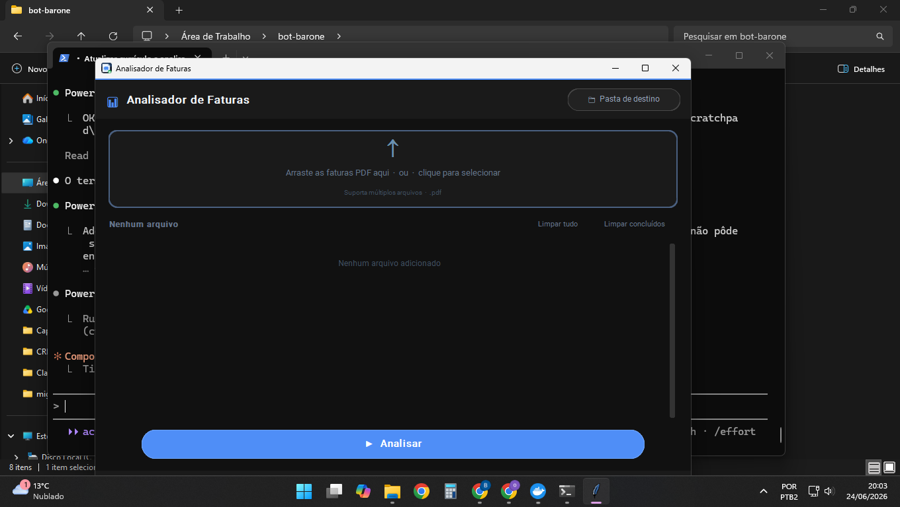
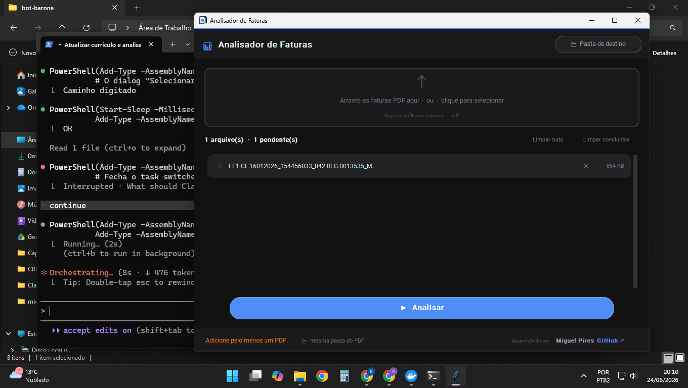
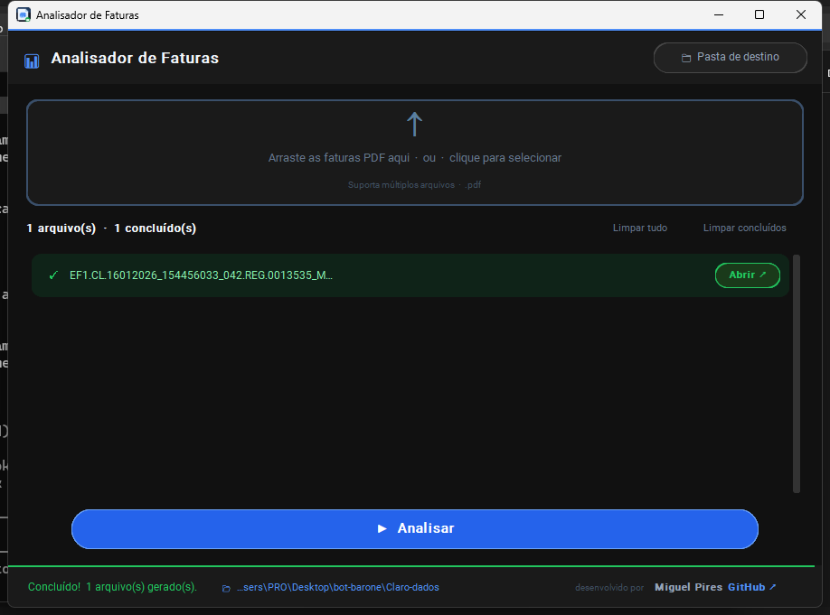

# Analisador de Faturas — Claro Empresas

> Extrai automaticamente dados de faturas PDF da Claro Empresas e gera planilhas Excel estruturadas, eliminando processamento manual de centenas de linhas telefônicas.

---

## Screenshots

| Tela inicial | PDF carregado | Processamento concluído |
|:---:|:---:|:---:|
|  |  |  |

---

## O que faz

Faturas Claro Empresas chegam como PDFs com dezenas ou centenas de páginas. Este sistema lê esses arquivos e extrai, para cada linha telefônica:

- Número de telefone
- Plano contratado (Plugin Smartphone, Tablet e Modem, Claro Pós, Claro Controle, Claro Flex)
- Valor mensal
- Consumo em MB
- GB compartilhado do plano
- Data de fidelidade

O resultado é um arquivo Excel no layout padrão **DETALHAMENTO**, pronto para uso.

### Resultado do teste real

```
PDF: 184 páginas | Fatura Claro Empresas
─────────────────────────────────────────
Total de linhas únicas: 444
  Plugin Smartphone:    286 linhas
  Tablet e Modem:       158 linhas
GB compartilhado:       900 GB
Data de fidelidade:     03/11/2026
Excel gerado em:        ~1 segundo
```

---

## Três formas de usar

### 1. Interface Desktop (GUI)

Arraste os PDFs para a janela ou clique para selecionar. Suporta múltiplos arquivos com processamento em lote.

```bash
python app_gui.py
# ou execute o .exe diretamente (sem Python necessário)
dist/Analisador de Faturas/Analisador de Faturas.exe
```

### 2. Linha de Comando (CLI)

```bash
# Uso básico
python main.py fatura.pdf

# Com saída personalizada
python main.py fatura.pdf resultado.xlsx

# Com log de diagnóstico
python main.py fatura.pdf resultado.xlsx --debug
```

### 3. API REST (Flask)

Ideal para integração com n8n, Make ou qualquer sistema de automação.

```bash
python api.py  # inicia na porta 8765
```

| Método | Rota | Descrição |
|--------|------|-----------|
| `GET` | `/health` | Status da API |
| `POST` | `/upload` | Envia PDF para o buffer da sessão |
| `POST` | `/generate` | Processa todos os PDFs e retorna Excel |
| `POST` | `/extract` | Processa PDF único e retorna Excel diretamente |

---

## Integração com n8n

O sistema foi projetado para ser integrado em fluxos automatizados. O workflow **"Leitura dados Claro"** no n8n recebe a fatura via WhatsApp (WAHA), envia para a API Flask, e devolve o Excel pronto para o usuário.

```
WhatsApp (WAHA) → n8n → POST /upload → POST /generate → Excel → WhatsApp
```

---

## Arquitetura

```
src/
├── parser/
│   ├── pdf_reader.py       # Orquestrador principal
│   ├── block_parser.py     # Análise de bounding boxes (posição do texto no PDF)
│   ├── phone_parser.py     # Extração de números telefônicos
│   ├── value_parser.py     # Extração de valores monetários
│   ├── mb_parser.py        # Extração de consumo em MB
│   ├── shared_plan.py      # Detecção de planos compartilhados
│   └── fidelity_parser.py  # Extração de datas de fidelidade
├── models/
│   └── line.py             # Dataclass PhoneLine
└── export/
    └── excel_exporter.py   # Geração do XLSX no layout DETALHAMENTO

app_gui.py   # Interface desktop (customtkinter + drag-and-drop)
api.py       # Servidor Flask com buffer de sessão
main.py      # Entry point CLI
build.bat    # Compila para .exe via PyInstaller
```

**Sem OCR.** O sistema usa análise de coordenadas de texto (bounding boxes do PyMuPDF) — mais rápido e mais preciso para PDFs com estrutura consistente.

---

## Instalação

```bash
git clone https://github.com/Miguel-Pires/Claro-Dados-Sistema-de-Extra-o-e-Processamento-de-Dados
cd Claro-Dados-Sistema-de-Extra-o-e-Processamento-de-Dados
pip install -r requirements.txt
```

### Dependências principais

| Pacote | Uso |
|--------|-----|
| `PyMuPDF` | Leitura e parsing de PDF |
| `Flask` | API REST |
| `openpyxl` | Geração do Excel |
| `customtkinter` | Interface gráfica |
| `tkinterdnd2` | Drag-and-drop na GUI |
| `PyInstaller` | Empacotamento em .exe |

---

## Tech Stack


---

Desenvolvido por **[Miguel Pires](https://github.com/Miguel-Pires)**